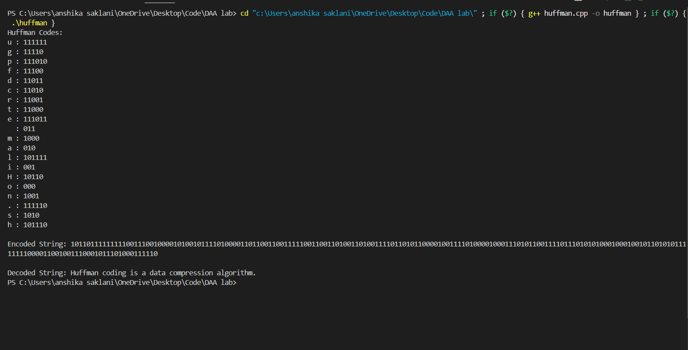

## Huffman Encoding

### Overview
Huffman Encoding is a lossless data compression algorithm that assigns variable-length binary codes to input characters based on their frequency. The characters with higher frequency are assigned shorter codes, whereas lower frequency characters get longer codes.




### Features
- Implements Huffman Encoding algorithm in Java.
- Uses a priority queue (min-heap) to build the Huffman tree.
- Generates binary codes for each character based on frequency.
- Takes user input for characters and their respective frequencies.
- Outputs the Huffman codes for the given input.

### Usage
1. **Compile the Java program:**
   ```sh
   javac HuffmanEncoding.java
   ```
2. **Run the program:**
   ```sh
   java HuffmanEncoding
   ```
3. **Enter the number of characters followed by each character and its frequency.**
4. **The program will output the corresponding Huffman codes.**

### Example
**Input:**
```
Enter string : XYZ ABC EFG
```

**Output:**
```
Huffman Codes are:
C : 00
D : 01
A : 10
B : 11
```

### Dependencies
- **Java Development Kit (JDK)**
- **A terminal or command prompt**

### How It Works
1. **Read the character frequencies from user input.**
2. **Construct a priority queue (min-heap) of Huffman nodes.**
3. **Extract the two nodes with the smallest frequency, merge them, and insert back into the queue.**
4. **Repeat until one node remains (the root of the Huffman tree).**
5. **Traverse the tree to generate and display Huffman codes.**

### Applications
- **Data compression (ZIP, GZIP, JPEG, MP3)**
- **Encoding and decoding messages**
- **Reducing bandwidth usage in transmission**

### Author
**Anshika Saklani**

### License
This project is open-source and available for use under the **MIT License**.

